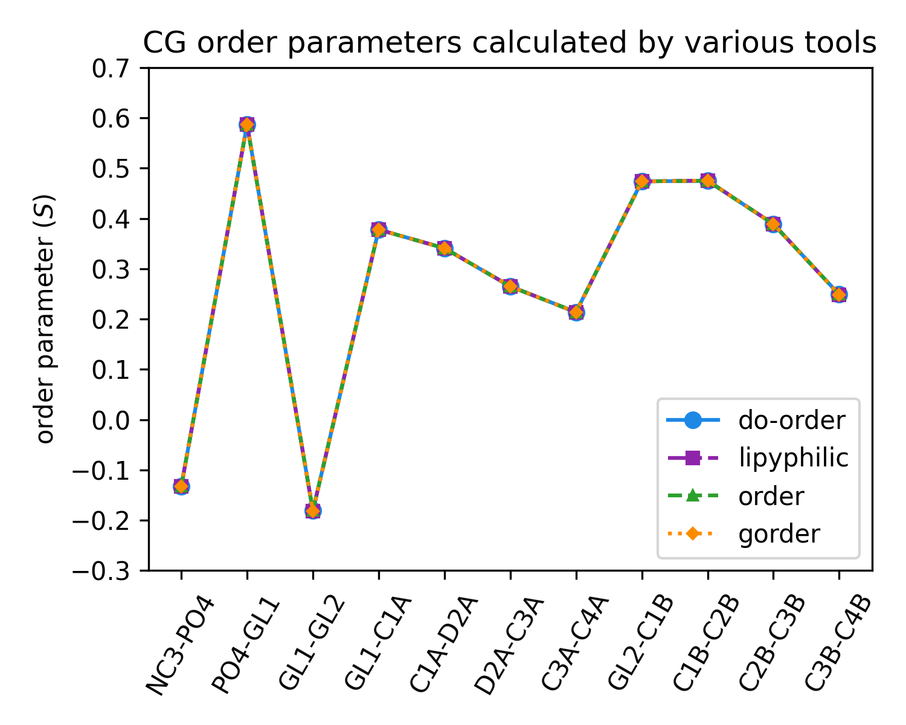
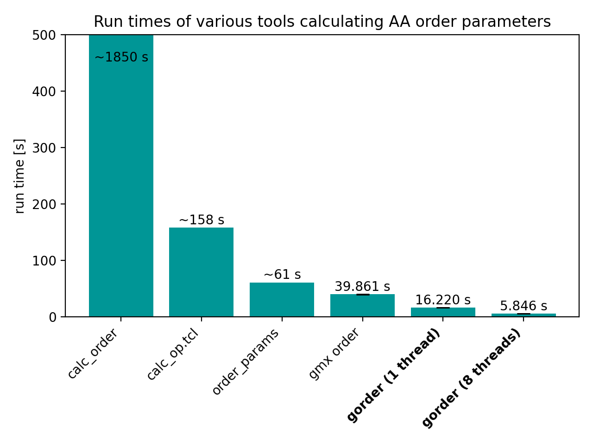
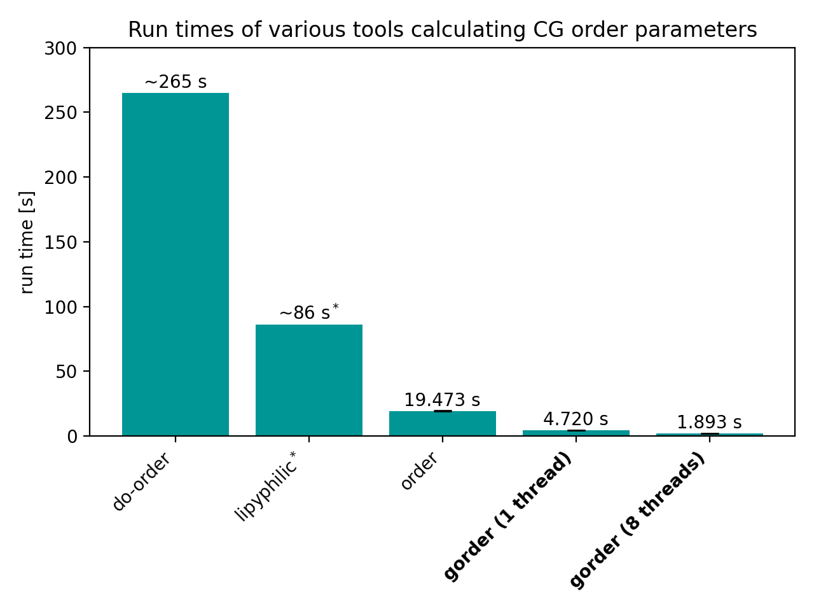

# gorder: Everything you will ever need for lipid order calculations
[](https://doi.org/10.5281/zenodo.14391305) 

Command line tool for calculating lipid order parameters from Gromacs simulations.

## Installation

1. [Install Rust](https://www.rust-lang.org/tools/install)

2. Install gorder:
```bash
$ cargo install gorder
```

## Usage

1) Prepare a yaml file describing the parameters of your analysis. It's as simple as:

```yaml
structure: system.tpr
trajectory: md.xtc     # use your MD trajectory directly - no PBC handling or molecule fixing needed
analysis_type: !AAOrder
    heavy_atoms: "element name carbon"
    hydrogens: "element name hydrogen"
output: order.yaml
```

2) Run the `gorder` tool. The program will automatically find bonds between the selected atoms, classify lipid molecules, and calculate order parameters for them.

```
$ gorder YOUR_INPUT_YAML_FILE
```

3) See the results of the analysis in `order.yaml`.

**See the [gorder manual](https://ladme.github.io/gorder-manual/) for more information about using this program.**

## Features
- ⚛️ **[Atomistic](https://ladme.github.io/gorder-manual/aaorder_basics.html), [coarse-grained](https://ladme.github.io/gorder-manual/cgorder_basics.html), and [united-atom](https://ladme.github.io/gorder-manual/uaorder_basics.html) systems**   
Calculates order parameters for individual bonds of individual lipid types in atomistic, coarse-grained, and united-atom systems.

- 🔠 [**Powerful selection language**](https://ladme.github.io/gsl-guide/)  
Allows for simple yet powerful atom selection using a VMD-like selection language, supporting regular expressions and groups from NDX files.

- 🔍 **Automatic identification of molecule types**  
Automatically recognizes bonds and classifies molecule types based on their topology. Order parameters are calculated and reported separately for each molecule type.

- 📋 [**Various output formats**](https://ladme.github.io/gorder-manual/output.html)  
Outputs results in YAML, XVG, CSV, and custom "table" format.

- 🏗️ **Any model and force-field**  
Is completely force-field agnostic. Martini? CHARMM? Slipids? Berger lipids? Your own toy force-field? As long as your lipids have bonds, it will work.

- 🍃 [**Leaflet-wise analysis**](https://ladme.github.io/gorder-manual/leaflets.html)  
Performs scrambling-safe assignment of lipids to membrane leaflets using three different methods, and then calculates lipid order parameters for individual leaflets.

- 🟠 [**Order parameters for vesicles**](https://ladme.github.io/gorder-manual/membrane_normal.html)  
Dynamically calculates membrane normals based on the membrane's shape, enabling the calculation of order parameters for highly curved systems such as micelles, tubes, and vesicles.

- 🗺️ [**Order parameter maps**](https://ladme.github.io/gorder-manual/ordermaps.html)  
Constructs 2D maps of order parameters, so you know what parts of the membrane are ordered and disordered.

- 📉 [**Error estimation**](https://ladme.github.io/gorder-manual/errors.html)  
Automatically estimates the error of the analysis and indicates how well your analysis has converged.

- 🌍 [**Analysis of specific membrane regions**](https://ladme.github.io/gorder-manual/geometry.html)  
Dynamically selects lipids in a specified part of the membrane and calculates order parameters only for them.

- ⚡ [**Extremely fast**](#benchmarking)  
Is extremely fast due to its ability to read only the necessary atoms from XTC files and its support for multithreading.

- 👨‍💻 **[Python](https://ladme.github.io/gorder-manual/python_api.html) and [Rust](https://ladme.github.io/gorder-manual/rust_api.html) API**  
Is also available as a Python package and a Rust crate, allowing seamless integration with Python and/or Rust code.

- 📖 [**Extensive manual**](https://ladme.github.io/gorder-manual/introduction.html)  
Includes a comprehensive manual detailing how to use the program, along with its strengths and limitations.

## Validation

### Atomistic order parameters
A CHARMM36m simulation of a membrane consisting of 256 lipids was used to validate the calculation of atomistic order parameters by the `gorder` program. In total, the system contained ~64,500 atoms. The trajectory was 200 ns long and consisted of 10,000 frames. The following programs were used for validation:
- [`OrderParameter.py` by NMR Lipids](https://github.com/NMRLipids/Databank/blob/6a91be2270e89ec7bb9c75006c2f2a2507c24a01/Scripts/BuildDatabank/OrderParameter.py)
- [VMD's `calc_op.tcl` script](https://www.ks.uiuc.edu/Research/vmd/mailing_list/vmd-l/att-14731/calc_op.tcl)

We also present a comparison of the calculated order parameters with the results from [`gmx order`](https://manual.gromacs.org/2021.4/onlinehelp/gmx-order.html) (version 2021.4). Note that `gmx order` actually calculates united atom order parameters, so it is not suitable for atomistic systems. (However, many users still utilize it.)


*All programs, except for `gmx order`, produce the same results. Minor variations due to different calculation approaches are too small to be visible in the chart. `gmx order` returns slightly different values (and no value for carbon #16) because it calculates united atom, not atomistic, order parameters.*

### Coarse-grained order parameters
A Martini 3 simulation of a membrane consisting of 512 POPC lipids was used to validate the calculation of CG order parameters by the `gorder` program. In total, the system contained ~16,800 beads. The trajectory had a length of 1 μs and consisted of 10,000 frames. The following programs/libraries were used for validation:
- [Martini's `do-order` script](https://cgmartini.nl/docs/downloads/tools/other-tools.html#do-order)
- [`lipyphilic` library](https://lipyphilic.readthedocs.io/en/stable/index.html)
- [Ladme's `order` program](https://doi.org/10.5281/zenodo.8369479)



*All programs produce the same results. Minor variations due to the employed calculation approaches are too small to be visible in the chart.*

## Benchmarking
### Atomistic order parameters
Run time of the analyses performed in the Validation section by various programs:


*Benchmarks were conducted on Debian 12 with an 8-core Intel Core i7-10700 CPU and SK Hynix BC511 HFM512GDJTNI SSD. Benchmarking of `gmx order` and `gorder` was performed using [`hyperfine`](https://github.com/sharkdp/hyperfine). The `NMR lipids` script and `calc_op.tcl` were dramatically slower, so only approximate values obtained using GNU's `time` are reported.*

<sup>a</sup> Note that, unlike `calc_op.tcl` and `gmx order`, the `OrderParameter.py` script provides information about the order of individual C-H bonds. `gorder` also provides this information.

<sup>b</sup> Note that `gmx order` calculates united atom order parameters, not atomistic order parameters. For saturated tails, this calculation is reasonably accurate; however, for unsaturated tails, it is **very** inaccurate [[1]](https://doi.org/10.1021/acs.jctc.7b00643). Additionally, it is slower and more tedious to use than `gorder`, so there is little justification for using it for atomistic systems.

### Coarse-grained order parameters
Run time of the analyses performed in the Validation section by various programs:


*Benchmarks were conducted on Debian 12 with with an 8-core Intel Core i7-10700 CPU and SK Hynix BC511 HFM512GDJTNI SSD. Benchmarking of `order` and `gorder` was performed using [`hyperfine`](https://github.com/sharkdp/hyperfine). `do-order` and `lipyphilic` were dramatically slower, so only an approximate value obtained using GNU's `time` is reported.*

<sup>a</sup> Note that the `do-order` script is not able to calculate order parameters for individual leaflets in the same run. In contrast, both `order` and `gorder` were run with this capability enabled.

<sup>b</sup> Note that the `lipyphilic` library is not able to calculate order parameters for the individual bonds simultaneously, requiring the analysis to be run multiple times. If you are only interested in average order parameters for one entire lipid tail, `lipyphilic` is quite fast (though still slower than `gorder`). Additionally, in this run, `lipyphilic` calculated order parameters only for the entire membrane, not for individual leaflets. In contrast, both `order` and `gorder` were run with this capability enabled.

## Python and Rust API
`gorder` is also available as a Python package and a Rust crate. For more information, see the [gorder manual](https://ladme.github.io/gorder-manual/), the [Python API documentation](https://ladme.github.io/pygorder-docs), or the [Rust API documentation](https://docs.rs/gorder/latest/gorder).

## License
The command line tool, the Python package, and the Rust crate are all released under the MIT License.

## Limitations
- `gorder` does not fully support simulation boxes that are **not** orthogonal. [You can still use them but it requires some additional effort.](https://ladme.github.io/gorder-manual/no_pbc.html)
- `gorder` does not support TPR files generated with Gromacs older than version 5.1. [But you can use PDB, GRO, or PQR file instead.](https://ladme.github.io/gorder-manual/other_input.html)
- `gorder` is developed for Linux. While it should work on other operating systems, it is not guaranteed.